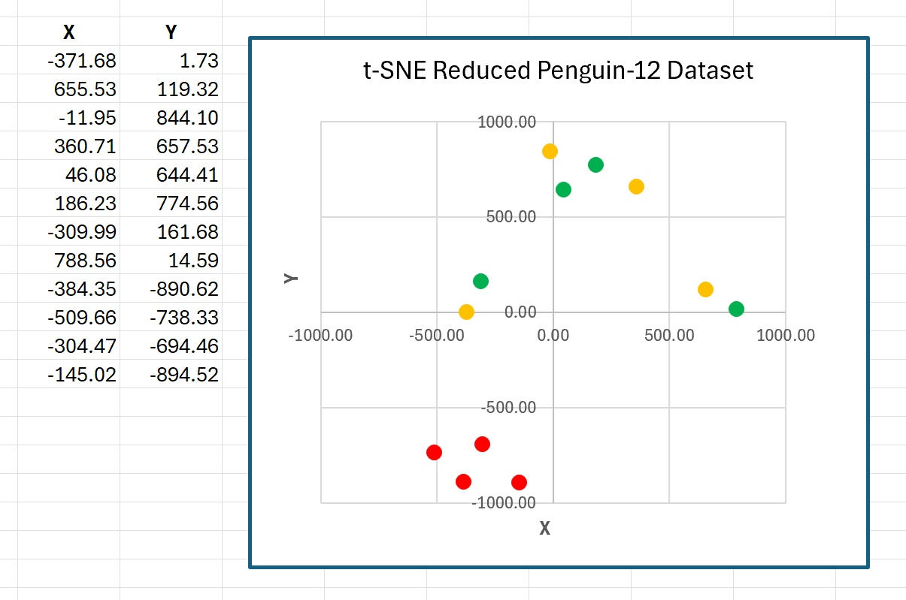

# tsne-csharp
Implementation of t-SNE visualization using C#.

The basic form of the t-SNE ("t-distributed Stochastic Neighbor Embedding") technique is very specific. It starts with source data that has n rows and 3 or more colmns, and creates a reduced dataset with n rows and 2 columns. The reduced data can be used to create an XY graph where the first column is used as the x values and the second column is used as the y values.

This C# implementation is a (mostly) direct translation of the original Python implementation written by researcher L. van der Maaten, who co-authored the original t-SNE paper. The original paper is "Visualizing Data using t-SNE" (2008), L. van der Maaten and G. Hinton. A link to the original Python implementation of t-SNE is at https://lvdmaaten.github.io/tsne/.

## Demo Data

The t-SNE implementation was tested using a tiny 12-item subset of the Penguin Dataset. The data is:

    0, 39.5, 17.4, 186, 3800  
    0, 40.3, 18.0, 195, 3250  
    0, 36.7, 19.3, 193, 3450  
    0, 38.9, 17.8, 181, 3625  
    1, 46.5, 17.9, 192, 3500  
    1, 45.4, 18.7, 188, 3525  
    1, 45.2, 17.8, 198, 3950  
    1, 46.1, 18.2, 178, 3250  
    2, 46.1, 13.2, 211, 4500  
    2, 48.7, 14.1, 210, 4450  
    2, 46.5, 13.5, 210, 4550  
    2, 45.4, 14.6, 211, 4800  

Each line represents a penguin. The fields are species (0 = Adelie, 1 = Chinstrap, 2 = Gentoo), bill length, bill width, flipper length, body mass. The species labels in the first column are not directly used by the t-SNE reduction function -- they are used only in a graph to verify that the reduced data accuractely reflects the source data.

## Usage

Calling code looks like:

    string ifn = @"C:\VSM\TSNE\Data\penguin_12.txt";  
    double[][] X = TSNE.MatLoad(ifn, new int[] { 1, 2, 3, 4 }, ',', "#"); // not col [0]  
    Console.WriteLine("Source data: ");  
    TSNE.MatShow(X, 1, 10, true); // 1 decimal, 10 wide, show indices  

    int maxIter = 500;  
    int perplexity = 3;  
    double[][] reduced = TSNE.Reduce(X, maxIter, perplexity);  

    Console.WriteLine("Reduced data: ");  
    TSNE.MatShow(reduced, 2, 10, true);  

    Console.WriteLine("Saving reduced data for a graph ");  
    string ofn = @"C:\VSM\TSNE\Data\penguin_reduced.txt";  
    TSNE.MatSave(reduced, ofn, ',', 2); // comma delim,  2 decimals  

The maxIter and perplexity parameter values must be determined by trial and error. A minor weakness of t-SNE is that the technique is often very sensitive to these values, and so tuning t-SNE can require quite a bit of time.

The demo program produces reduced data that looks like:

    -371.68,    1.73
     655.53,  119.32
     -11.95,  844.10
     360.71,  657.53
      46.08,  644.41
     186.23,  774.56
    -309.99,  161.68
     788.56,   14.59
    -384.35, -890.62
    -509.66, -738.33
    -304.47, -694.46
    -145.02, -894.52

I manually dropped the reduced data into an Excel spreadsheet, added the class labels, and made an XY graph:

The graph shows that one species (2 = Gentoo) is distinct from the other two.

## Demo Program

The demo code in file TSNEProgram.cs is organized as a single C# wrapper class named TSNE that houses a static Reduce() function. The Reduce() function calls two primary helper functions, ComputeP() and ComputePH(). Then there are 32 secondary helper functions that do things, such as matrix addition, that are built into Python, but must be implemented in C#. The TNSE class also contains a nested Gaussian class, which is used to initialize the result reduced matrix to random Gaussain values with mean 0 and standard deviation 1.

